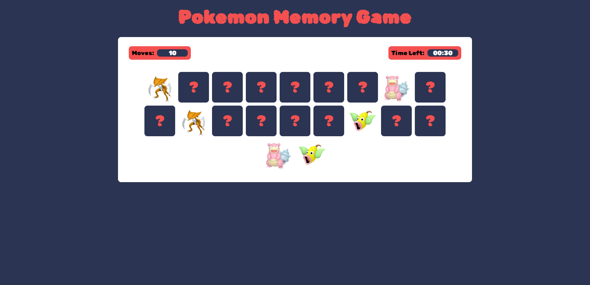
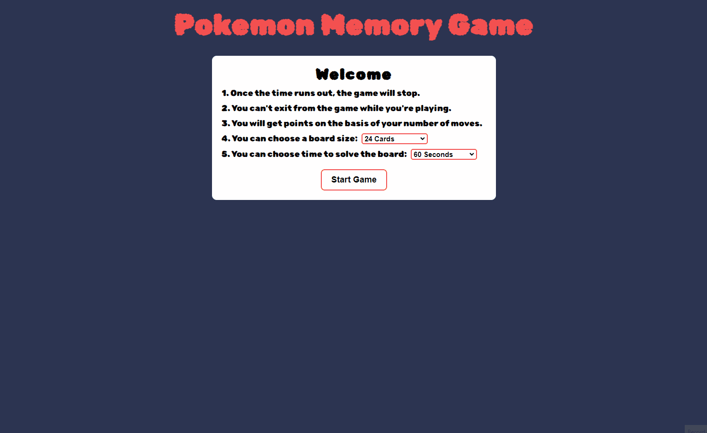

# Pokemon Memory Game

Welcome to the Pokemon Memory Game! 
This game is designed to test your memory skills while enjoying the delightful world of Pokemon. 
Match the pairs of Pokemon cards to win the game. 
The game features images of Pokemons sourced from the Poke API, along with sound effects from the Pokemon anime series.
Built using html,css and javascript.

## Features
- Beautifully designed game interface with responsive design
- Sound effects for starting the game, clicking on cards, losing and winning the game
- Timer to track your game completion time
- Score tracking to keep a record of your moves
- Difficulty levels to challenge your memory skills
- Ability to choose the game difficulty, including the number of cards and time limit

## Overview

## Demo
> This gif shows a brief overview of the project, and it may take a while to load!

## Getting Started
To clone and run this project locally, follow these steps:
- Clone the Repository: git clone https://github.com/mohammedamcs/pokemon-memory-game.git
- Navigate to the project directory: cd pokemon-memory-game
- Open the index.html file in your preferred web browser.

## Gameplay
1. Upon launching the game, you will be greeted with a start screen.
2. Choose time required to finish the game and the number of cards.
3. Click on the "Start Game" button to begin.
4. You will be presented with a grid of face-down Pokemon cards.
5. Click on any card to reveal the Pokemon image beneath it.
6. Click on a second card to reveal its image as well.
7. If the two cards match, they will remain face-up, and you can continue to the next pair.
8. If the cards do not match, they will flip back face-down, and you can try again.
9. Continue flipping pairs of cards until all matches have been found.
10. The game ends when all pairs have been matched.
11. If you win the game, you will be greeted with a congratulatory message and the iconic "I choose you" sound from the Pokemon anime series.
## Credits
- Pokemon images: [Poke API](https://pokeapi.co/)
- Sound effects: Pokemon anime series

Enjoy playing the Pokemon Memory Game! Gotta catch 'em all!
